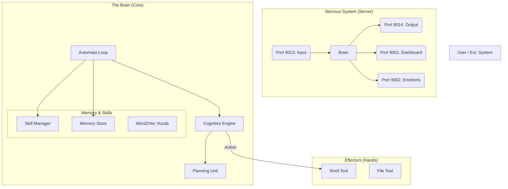

# Brain System Documentation (Release 1.0)

## 1. System Overview

The **Brain** is an autonomous, bio-mimetic artificial intelligence agent designed to learn and evolve like a biological organism. Unlike traditional LLM wrappers, the Brain runs on a custom C++ cognitive engine that combines **Reinforcement Learning (RL)**, **Plastic Neural Networks**, and **Modular Skill Systems**.

It operates in a continuous "Living Loop" (2Hz tick rate), managing its own biological needs (Energy, Hunger), emotional state, and cognitive development.

### Core Philosophy
*   **Embodiment**: The AI "feels" its system state (CPU load = stress, Battery = energy).
*   **Autonomy**: It decides what to do (Sleep, Explore, Research) without user prompting.
*   **Plasticity**: It learns new words and capabilities on-the-fly (One-Shot Learning).
*   **Decoupled I/O**: Perception (Input) and Action (Output) are handled by separate neural ports.

---

## 2. Architecture

The system is built as a highly concurrent C++20 application.



### Key Components

| Component | Responsibility | Implementation Details |
| :--- | :--- | :--- |
| **Brain (Class)** | Central orchestrator. Manages local state, threads, and integrates all subsystems. | `src/brain.cpp` |
| **CognitiveEngine** | The "Will" of the agent. Uses Deep Q-Networks (DQN) to select actions based on state. | `src/cognitive_engine.cpp` |
| **SkillManager** | The "Specialist". Creates/Trains dedicated DNNs for specific tasks (Math, Coding). | `src/skill_manager.cpp` |
| **NeuralNetwork** | Custom vectorized (AVX2) neural net library. Supports "Plastic Layers" (Hebbian learning). | `src/dnn.cpp` |
| **ToolRegistry** | The "Body". Interfaces with the OS (Shell, Filesystem) to execute actions. | `include/tool_registry.hpp` |
| **MemoryStore** | Long-term explicit memory. Supports vector search and tagging. | `include/memory_store.hpp` |

---

## 3. The Cognitive Process (The "Loop")

The Brain runs a main loop (`Brain::automata_loop`) that mimics biological consciousness:

1.  **State Observation**: Collates sensory data, biological stats (Energy, Hunger), and emotional affect.
2.  **Decision (RL)**: The `CognitiveEngine` evaluates the state and chooses an action:
    *   `SLEEP`: Regenerates Energy, consolidates Memory.
    *   `EXPLORE`: Uses `ShellTool` to look around (`ls`, `whoami`).
    *   `SPEAK_BABBLE`: Practices language by saying random words.
    *   `RESEARCH`: Fetches external info (simulated).
3.  **Action Execution**: The chosen tool/function is executed.
4.  **Reward/Penalty**:
    *   **Positive**: Successful tool use, learning new things, maintaining homeostasis.
    *   **Negative**: Failed commands, high boredom, low energy.
5.  **Learning**: The Experience Tuple `(State, Action, Reward, NextState)` is stored in the Replay Buffer and used to train the DQN.

---

## 4. Modular Skill System (MoE)

The Brain uses a **Mixture of Experts** approach for complex tasks. It does not rely on one giant model.

*   **Creation**: When you say `"Learn: Cooking Input: ... Output: ..."`, the `SkillManager` spins up a *new*, blank Neural Network (`Cooking.dnn`).
*   **Training**: It trains this specific network on the provided examples.
*   **Merging**: If you later teach `"Grilling"`, the system detects similarity to `"Cooking"` and merges the weights, preventing fragmentation.
*   **Persistence**: Skills are saved to `data/skills/*.dnn`.

---

## 5. Neural Ports (I/O)

The Brain communicates via 14 specialized TCP ports, mimicking a nervous system.

| Port | Name | Direction | Purpose |
| :--- | :--- | :--- | :--- |
| **9001** | Dashboard | Duplex | JSON stream for Web UI / Visualization. |
| **9002** | Emotions | Output | Real-time stream of hormone levels (Energy, Boredom). |
| **9003** | Logs | Output | System debug logs. |
| **9005** | Chat | Duplex | Legacy Chat interface. |
| **9006** | Thoughts | Output | Stream of Consciousness (Internal Monologue). |
| **9012** | Graph | Output | Knowledge Graph updates. |
| **9013** | **Input** | **In Only** | **Afferent Nerve**: Sensory text input. No reply sent here. |
| **9014** | **Output** | **Out Only** | **Efferent Nerve**: Motor/Speech output. |

---

## 6. Language Acquisition

The Brain implements **One-Shot Learning**:
*   **Unknown Token Detection**: If it hears a word it doesn't know, it doesn't error.
*   **Embedding Generation**: It generates a unique, random high-dimensional vector for the new word immediately.
*   **Persistence**: This vocabulary is saved to `state/vocab.txt`.
*   **Babbling**: The RL engine occasionally triggers "Babbling", where the Brain speaks random words from its vocab to practice/reinforce them.

---

## 7. Build & Running

### Requirements
*   Linux (x86_64)
*   GCC 15+ (C++20 support)
*   CMake
*   Optional: PostgreSQL/Redis (The code supports "Lite Mode" auto-stubbing if missing).

### Compilation (Lite Mode)
This mode compiles without heavy database dependencies.

```bash
g++ -std=c++20 -mavx2 -mfma -I include \
    src/main.cpp src/brain.cpp src/cognitive_engine.cpp \
    src/skill_manager.cpp src/dnn.cpp src/task_manager.cpp \
    src/planning_unit.cpp \
    -o brain_lite
```

### Execution
```bash
./brain_lite
```

### Interaction
Once running:
*   **Console**: Type directly to chat.
*   **Netcat**: `nc localhost 9013` to speak to it, `nc localhost 9014` to hear it.

---

## 8. Docker Deployment

The system is fully containerized for easy deployment.

### Prerequisites
*   Docker & Docker Compose

### Start System
```bash
docker-compose up --build
```
This launches:
1.  **Brain**: Main cognitive engine (Ports 9001-9014).
2.  **PostgreSQL**: Long-term memory storage.
3.  **Redis**: Short-term associative cache.
4.  **Web Dashboard**: Visual interface at `http://localhost:5000`.

### Verifying Docker Status
```bash
# Check logs
docker-compose logs -f brain

# Test Input Port
echo "Hello Docker" | nc localhost 9013
```
