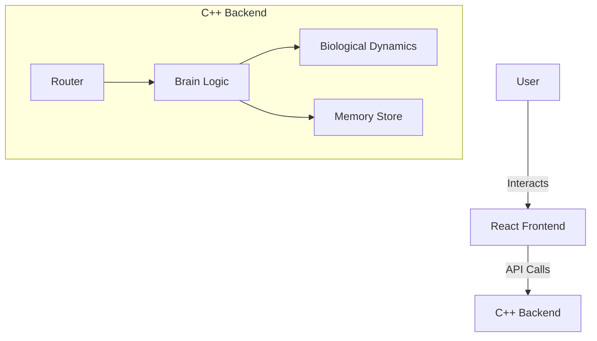

# Developer Guide: Brain Project

## Overview
The Brain Project is a sophisticated AI simulation that models biological dynamics and cognitive processes. It uses a hybrid architecture with a high-performance C++ backend for the core logic and a React-based frontend for visualization and interaction.

## Architecture
The system consists of two main components:
1.  **Backend (C++)**: Handles the core "Brain" logic, including biological homeostasis, cognitive units, and memory management. It exposes an API for the frontend.
2.  **Frontend (React)**: Provides a visual interface to monitor the brain's state (emotions, needs, thoughts) and interact with it.

### Mermaid Diagram


## Setup & Prerequisites

### Prerequisites
- **C++ Compiler**: GCC (supporting C++20 or later) or Clang.
- **CMake**: Version 3.10+.
- **Node.js & npm**: For the frontend.
- **Docker**: Optional, for containerized development.

### Setup Instructions
1.  **Clone the repository**:
    ```bash
    git clone <repo_url>
    cd brain
    ```
2.  **Backend Setup**:
    ```bash
    mkdir build
    cd build
    cmake ..
    make
    ```
3.  **Frontend Setup**:
    ```bash
    cd web/client
    npm install
    ```

## Key Components & APIs

### Backend
- **[brain.cpp](file:///home/ravi/workspace/brain/src/brain.cpp)**: The main entry point for the brain logic.
- **[research_utils.hpp](file:///home/ravi/workspace/brain/include/research_utils.hpp)**: Utilities for research and data analysis.
- **[test_emotion_logic.cpp](file:///home/ravi/workspace/brain/tests/test_emotion_logic.cpp)**: Tests for emotional dynamics.

### Frontend
- **[App.jsx](file:///home/ravi/workspace/brain/web/client/src/App.jsx)**: Main React component.
- **[useBrain.js](file:///home/ravi/workspace/brain/web/client/src/hooks/useBrain.js)**: Custom hook for interacting with the Brain API.

## Data Schema & Models
- The brain uses an internal memory model (likely vector-based or symbolic, depending on implementation details in `dnn.hpp`).
- Biological state includes variables for `hunger`, `thirst`, `energy`, etc.

## Extension Points
- **New Cognitive Units**: inherited from a base `Unit` class.
- **New Sensors**: Implement the `ISensor` interface (e.g., `TactileUnit`).

## Troubleshooting (Internal)
- **Build Fails**: Ensure CMake caches are cleared (`rm -rf build/*`).
- **Frontend Connection**: Check if the backend server is running on the expected port (default 8080 or similar).

---
**Author:** Antigravity Agent
**Date:** 2026-01-05
