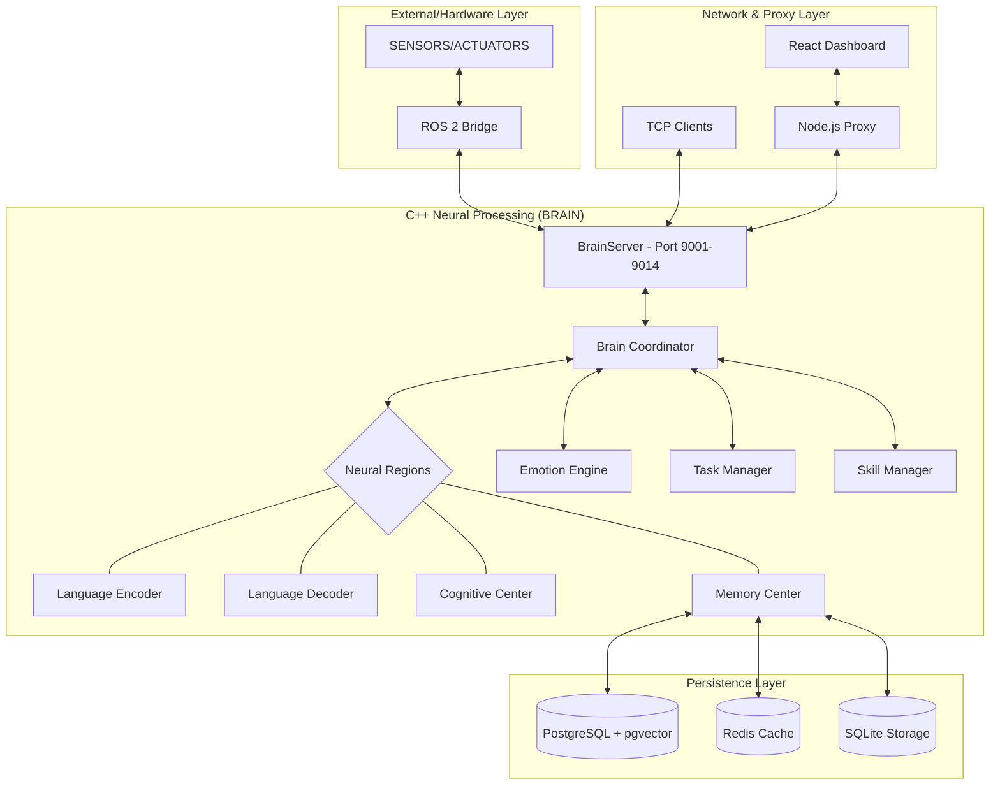
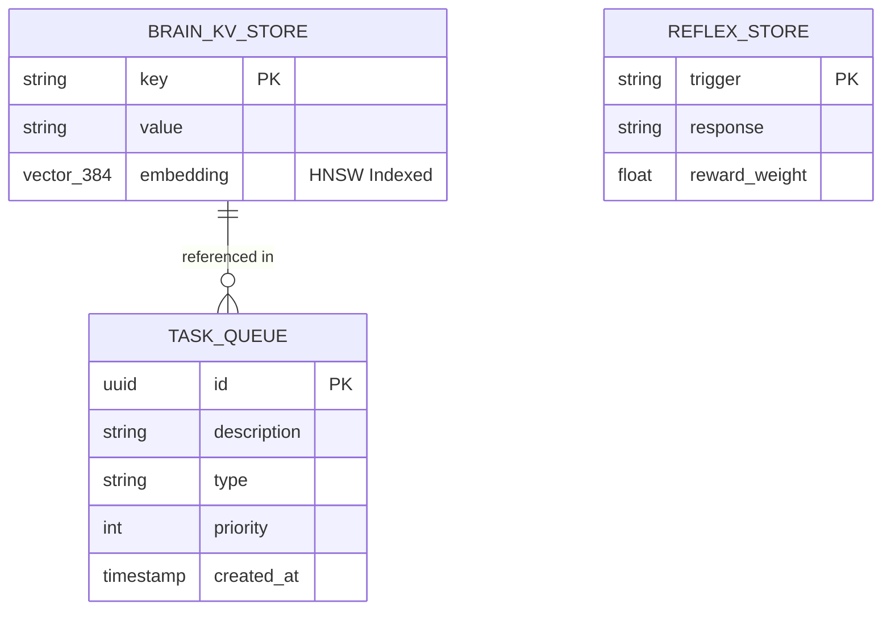
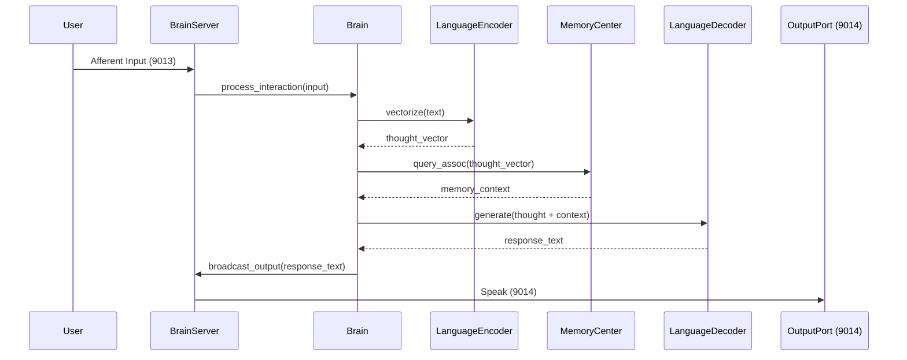

# Architectural Overview - Brain Replica

## System Decomposition

## Data Model (ERD)

## Sequence: Interaction Loop

## Interface Specifications

### 1. Neural Interface (`Region`)
- `process(input_vector)`: Normalizes and propagates through the network.
- `reinforce()`: Updates synaptic weights based on recently active neurons.

### 2. Storage Interface (`MemoryStore`)
- `store(key, value, embedding)`: Persistent record.
- `query(search_term)`: RAG lookup.
- `forget(ttl)`: Maintenance logic.

### 3. Server Interface (`TcpServer`)
- `start()`: Bind and listen.
- `broadcast(msg)`: Relay to all listeners.
- `on_input(callback)`: Hook for afferent data.
