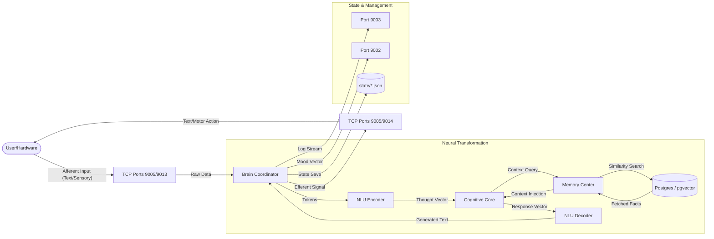

# Data Flow Diagram (DFD) - Brain Replica

## Purpose
Visualizes the flow of sensory data and thoughts from input to persistence and output.

## High-Level Data Flow

## Detailed Transformation Steps

1. **Vectorization**: Input string is hashed and weighted into a $V \times 1$ sparse vector.
2. **Encoding**: NLU Regions transform sparse input into a dense $128 \times 1$ latent thought vector.
3. **Retrieval**: Thought vector triggers a Cosine Similarity query in Postgres via the pgvector extension.
4. **Synthesis**: Thought + Context + Emotions are fed into the Cognitive Center for decision making.
5. **Expression**: Result is decoded back to human-readable strings via a Softmax-like logits evaluation.
