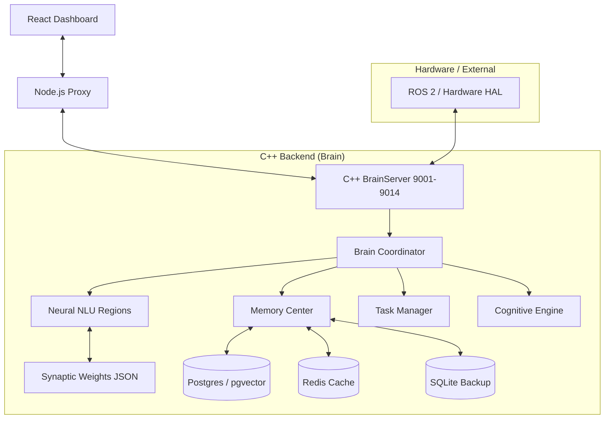

# System Map - Brain Replica Architecture

## High-Level Topology

## Module Definitions

### 1. Communication Layer (`TcpServer`)
Manages raw TCP connections with rate limiting and basic protocol handling (JSON/Raw).

### 2. Neural Layer (`Region`, `Synapse`)
Implements the core learning mechanics. Uses a three-layer topology per region:
- **Input**: Vectorized sensory/text data.
- **Hidden**: Latent representation (Synapses).
- **Output**: Decodable result.

### 3. Emotional Engine
A finite state machine that modulates the NLU output based on energy and mood variables.

### 4. Skill Manager
A specialized persistent store for "Input-Output" mappings that can be trained on-the-fly without retraining the entire brain.

### 5. Memory Interface (`PostgresStorage`)
Uses `pgvector` for semantic search. Queries are performed using cosine similarity on 384-dim embeddings.
