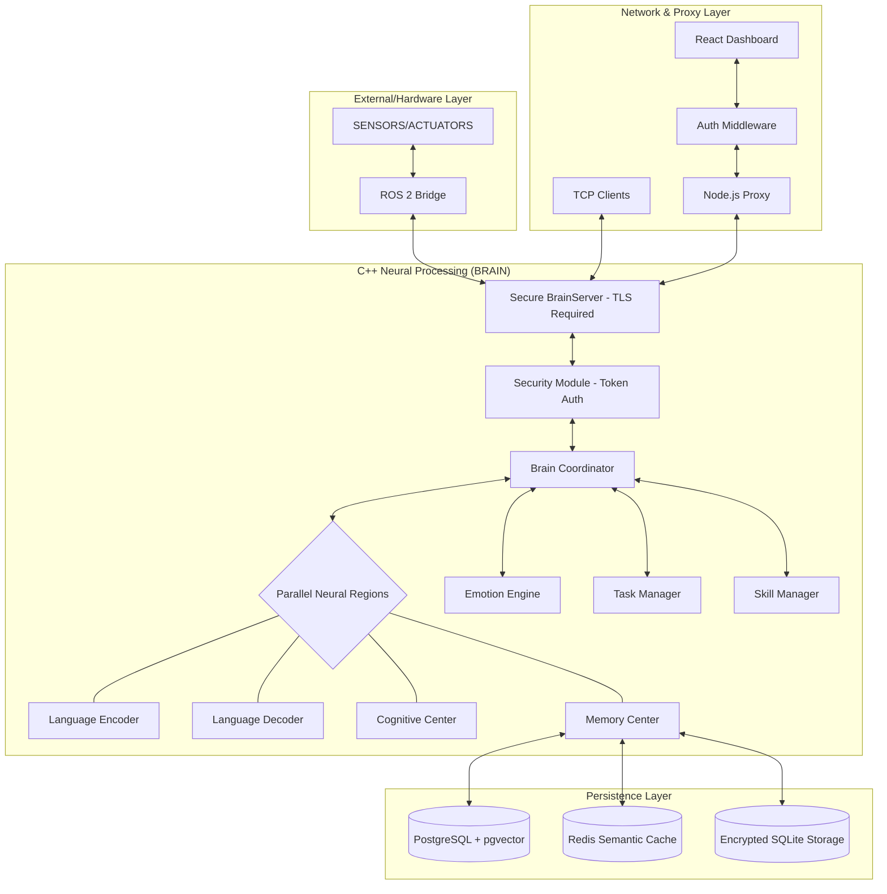

# Architecture: To-Be - Brain Replica

## Purpose
This document outlines the target architecture for the Brain Replica, incorporating planned security and cognitive enhancements (Milestones M2-M4).

## Target Architecture Model

## Key Architectural Changes (To-Be)

### 1. Security-by-Design (`M2`)
- **Token Injection**: A new `Security Module` in the C++ core will validate tokens for sensitive ports (9009, 9011).
- **TLS/SSL**: Implementation of encrypted communication between the Proxy and BrainServer.
- **RESTful Auth**: The Node.js Proxy will manage user sessions and tokens before bridging to the C++ layer.

### 2. Parallel Cognitive Processing (`M4`)
- **TBB/OpenMP Integration**: Neural regions (`Region`) will leverage multi-threading for the `process()` loop, allowing simultaneous encoding and memory retrieval.

### 3. Biological Memory Decay (`M3`)
- **Background Consolidator**: A background thread in `MemoryCenter` that runs periodic TTL cleanup on the Postgres store, simulating cognitive forgetting.

### 4. Semantic Cache Tier (`M4`)
- **Redis Integration**: Move from simple associative cache to a semantic vector cache in Redis, reducing Postgres load.
